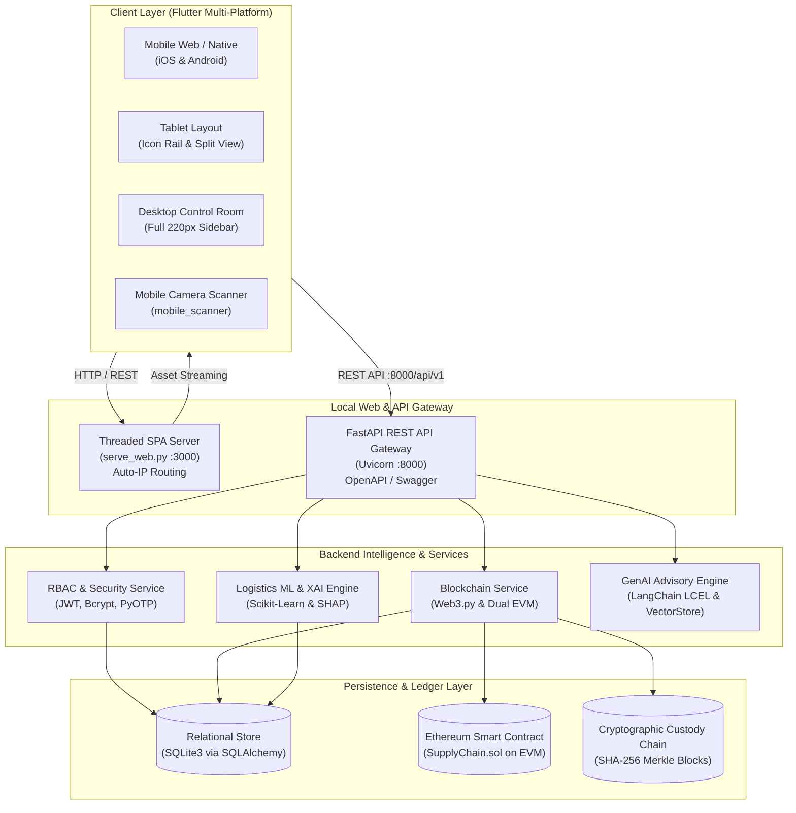

# SupplyChainX — Complete Technology Stack & Architectural Specification

> **Document Type**: System Architecture & Technology Stack Specification  
> **Project**: SupplyChainX (AI-Powered Smart Supply Chain & Decentralized Traceability Platform)  
> **Author**: Engineering Architecture Team  
> **Status**: Production-Ready / Fully Verified  

---

## Table of Contents

1. [System Architecture Overview](#1-system-architecture-overview)
2. [End-to-End Architectural Diagram](#2-end-to-end-architectural-diagram)
3. [Frontend & Client Application Layer (`supplychainx_app`)](#3-frontend--client-application-layer)
4. [Backend API & Application Layer (`backend`)](#4-backend-api--application-layer)
5. [Blockchain, Smart Contracts & Cryptography](#5-blockchain-smart-contracts--cryptography)
6. [Machine Learning & Explainable AI (XAI)](#6-machine-learning--explainable-ai-xai)
7. [Generative AI & Natural Language Advisory](#7-generative-ai--natural-language-advisory)
8. [Identity, Authentication & Role-Based Access Control (RBAC)](#8-identity-authentication--role-based-access-control-rbac)
9. [Networking, Multi-Device Deployment & DevOps](#9-networking-multi-device-deployment--devops)
10. [Complete Package & Dependency Manifest](#10-complete-package--dependency-manifest)

---

## 1. System Architecture Overview

SupplyChainX is a multi-tier, enterprise-grade supply chain tracking, physical provenance, and tamper-verification platform. It operates across 5 discrete supply chain stakeholders:
1. **Manufacturer** (Product registration, Genesis block creation, physical HMAC-SHA256 packaging QR generation)
2. **Distributor** (Transit intake, corridor routing, GPS waypoint logging)
3. **Warehouse** (Robotic bay inventory control, environmental temperature audits, inventory counts)
4. **Retailer** (Store intake, POS shelf verification, consumer sales transactions)
5. **Customer** (Public provenance verification, cryptographic ledger inspection, counterfeit detection)

The platform bridges physical consignments with an immutable ledger using physical QR codes containing verification URLs, cryptographic HMAC signatures, EVM smart contracts, and explainable ML transit risk analytics.

---

## 2. End-to-End Architectural Diagram



---

## 3. Frontend & Client Application Layer

The frontend application (`supplychainx_app`) is built with Flutter and engineered to deliver an adaptive industrial control room UI across small phones, tablets, and ultrawide desktop monitors.

### Core Technologies

| Category | Technology | Version | Purpose & Architectural Role |
| :--- | :--- | :--- | :--- |
| **Framework** | **Flutter SDK** | `^3.x` | Cross-platform UI toolkit targeting Web (CanvasKit/HTML), iOS, Android, and Windows |
| **Language** | **Dart** | `>=3.0.0 <4.0.0` | Strongly-typed, object-oriented language with pattern matching, records, and sound null safety |
| **State Management** | **Flutter Riverpod** | `^2.5.1` | Reactive, testable state management without `BuildContext` dependency; powers `productsProvider`, `authProvider`, and telemetry |
| **Code Generation** | **Riverpod Generator** | `^2.4.0` | Compile-time generation of scoped providers and family modifiers |
| **Routing** | **GoRouter** | `^14.0.0` | Declarative routing with deep linking, query parameter binding, sub-routes, and authentication redirection guards |
| **Typography** | **Google Fonts** | `^6.2.1` | Typography using `Inter` for UI components and `JetBrains Mono` for cryptographic hashes, addresses, and serials |
| **Charts** | **fl_chart** | `^0.68.0` | Dynamic data visualization: corridor latency curves, risk level histograms, and supplier performance radar |
| **QR Generation** | **qr_flutter** | `^4.1.0` | Client-side visible square QR code renderer compliant with ISO/IEC 18004 standards for packaging stickers |
| **Camera Scanner** | **mobile_scanner** | `^5.1.1` | High-speed native barcode and QR camera scanner supporting direct verification URL routing |
| **HTTP Client** | **Dio** | `^5.4.3` | Interceptor-driven HTTP client managing automated Bearer JWT injection, base URL resolution, and timeout retry |
| **Logging** | **pretty_dio_logger** | `^1.3.1` | Detailed color-coded console logging for request payloads, response codes, and latency timing |
| **Secure Storage** | **flutter_secure_storage** | `^9.2.2` | Keychain/Keystore encrypted storage on mobile; secure memory fallback on web for auth credentials |
| **Cryptography** | **crypto / encrypt / pointycastle** | `^3.0 / ^5.0` | Client-side SHA-256 fingerprint verification and AES data protection |
| **2FA / OTP** | **otp** | `^3.1.4` | TOTP RFC 6238 generation and client-side verification |
| **Animations** | **flutter_animate / lottie** | `^4.5 / ^3.1` | Micro-interactions for blockchain block sealing, stage progression bars, and pulse indicators |

### Responsive Engine (`lib/core/theme/responsive.dart`)

The UI is governed by a unified responsive engine:
- **`ResponsiveBreakpoints`**:
  - `smallMobile`: `< 380px` (iPhone SE, foldable outer screens, split-view windows)
  - `mobile`: `380px – 640px` (standard smartphones)
  - `tablet`: `640px – 1024px` (iPads, Android tablets, compact laptops)
  - `desktop`: `1024px – 1440px` (standard desktop monitors)
  - `wideDesktop`: `1440px+` (ultrawide / 4K displays)
- **`ResponsiveKpiGrid`**: Replaces hardcoded grid counts with dynamic column computation (1, 2, 3, or 4 columns) and calculated aspect ratios (`1.55` to `2.7`) to eliminate `RenderFlex` overflow errors.
- **`ResponsiveRowColumn`**: Automatically flips horizontal multi-field forms into vertical single-column inputs on phone viewports.
- **Dual-Mode Dashboards**: Automatically swaps dense desktop tabular grids for touch-friendly cards on screens `< 720px`.
- **3-Tier Adaptive Shell (`DashboardShell`)**:
  - *Desktop*: 220px dark industrial sidebar + top operations bar.
  - *Tablet*: 68px icon rail + system tools popup menu.
  - *Mobile*: Clean header + 4-tab bottom navigation + slide-out System & Tools drawer (ML Studio, AI Assistant, Analytics, Security, Audit Logs).

---

## 4. Backend API & Application Layer

The backend (`backend`) is an asynchronous REST and WebSocket API built with Python 3.14 and FastAPI.

### Core Technologies

| Category | Technology | Version | Purpose & Architectural Role |
| :--- | :--- | :--- | :--- |
| **Runtime** | **Python** | `3.14.x` | High-performance asynchronous runtime |
| **Web Framework** | **FastAPI** | `>=0.110.0` | High-throughput async web framework with automatic OpenAPI / Swagger documentation (`/docs`) |
| **ASGI Server** | **Uvicorn** | `>=0.28.0` | Lightning-fast ASGI web server with event loop concurrency |
| **Data Validation** | **Pydantic v2** | `>=2.6.0` | Strict data validation, schema enforcement, and JSON serialization |
| **Configuration** | **Pydantic Settings** | `>=2.2.0` | Type-safe environment variable management via `.env` |
| **ORM Engine** | **SQLAlchemy** | `>=2.0.28` | Modern async-compatible SQL ORM mapping Python models to relational tables |
| **Relational DB** | **SQLite3** | Native | Zero-dependency ACID-compliant local database storing products, custody blocks, users, and audit logs |
| **HTTP Clients** | **HTTPX / Requests** | `>=0.27.0` | Outbound HTTP client for third-party oracles and remote Ethereum RPC nodes |
| **Test Engine** | **Pytest / AnyIO** | `>=8.0.0` | Comprehensive test runner verifying smart contracts, ML pipelines, and custody state machines |

---

## 5. Blockchain, Smart Contracts & Cryptography

SupplyChainX implements decentralized provenance and tamper-evident custody through Ethereum-compatible smart contracts and cryptographic chains.

### Core Components

```
Product Registration (Manufacturer)
   │
   ├─► Genesis SHA-256 Hash Generated (ID + Name + Batch + Factory + Timestamp)
   ├─► Physical HMAC-SHA256 Packaging Signature Sealed
   ├─► SupplyChain.sol::registerProduct() Committed to EVM State
   └─► Block #0 Recorded in Cryptographic Custody Chain
```

| Component | Technology | Implementation Details |
| :--- | :--- | :--- |
| **Smart Contract Language** | **Solidity `^0.8.20`** | [`SupplyChain.sol`](file:///D:/cs/supplychainx/backend/contracts/SupplyChain.sol) & [`ISupplyChain.sol`](file:///D:/cs/supplychainx/backend/contracts/ISupplyChain.sol) implementing RBAC roles, product registration, custody transfer, location updates, and verification. |
| **Web3 Client** | **Web3.py `>=6.x`** | Interacts with local Ganache / Hardhat / Ethereum JSON-RPC nodes. |
| **Dual-Engine Execution** | **Hybrid EVM Engine** | **Live Mode**: Submits on-chain transactions to Ethereum RPC.<br>**In-Memory EVM Engine**: High-fidelity local state machine mirroring `SupplyChain.sol` mappings for offline resilience. |
| **Genesis Hashing** | **SHA-256 (`hashlib`)** | Computes deterministic `bytes32` hashes binding immutable product metadata to the Genesis block. |
| **Physical Tamper Seal** | **HMAC-SHA256 (`cryptography`)** | Secret-key cryptographic signature verifying physical packaging stickers against on-chain root records. |
| **Packaging QR Engine** | **`qrcode` (PIL / Pillow)** | Converts verification URL (`https://supplychainx.com/verify/{id}`) into raw PNG bytes and Base64 inline strings (Point 12 specification). |
| **Merkle Audit Trail** | **Custody Blocks** | Each transfer appends an immutable cryptographic block (`previous_hash`, `block_hash`, `timestamp`, `actor_role`). |

### Smart Contract Specification (`SupplyChain.sol`)

```solidity
enum Role { None, Manufacturer, Distributor, Warehouse, Retailer, Customer }

struct Product {
    string productId;
    bytes32 productHash;
    address manufacturer;
    address currentOwner;
    string currentLocation;
    string status;
    uint256 createdAt;
    bool exists;
}

struct History {
    address from;
    address to;
    string location;
    string action;
    uint256 timestamp;
}
```

---

## 6. Machine Learning & Explainable AI (XAI)

The ML subsystem provides proactive logistics risk intelligence, forecasting corridor delays and explaining risk drivers to dispatchers.

| Component | Technology | Implementation Details |
| :--- | :--- | :--- |
| **Predictive Model** | **Scikit-Learn (`>=1.4.0`)** | Ensemble Gradient Boosting Classifier & Random Forest trained on corridor telemetry (origin, destination, distance, weather severity, transit season, and carrier reliability). |
| **Numerical Processing** | **NumPy (`>=1.26.0`) & Pandas (`>=2.2.0`)** | High-speed tensor math and vectorized feature engineering for logistics telemetry. |
| **Model Serialization** | **Joblib (`>=1.4.0`)** | Serializes trained ML pipelines and feature encoders for zero-latency inference. |
| **Explainable AI (XAI)** | **SHAP (`>=0.45.0`)** | TreeExplainer calculating Shapley feature contributions (waterfall explanations) showing *why* a particular transit corridor was flagged as delayed. |

---

## 7. Generative AI & Natural Language Advisory

The Generative AI subsystem offers conversational logistics support, regulatory compliance audit queries, and automated anomaly summaries.

| Component | Technology | Implementation Details |
| :--- | :--- | :--- |
| **Orchestration** | **LangChain (`langchain-core >=0.3.0`, `langchain-community`)** | LangChain Expression Language (LCEL) chains managing context retrieval, prompt formatting, and structured generation. |
| **LLM Providers** | **Google GenAI / Gemini (`langchain-google-genai >=2.0.0`) & HuggingFace** | Conversational logistics advisory, intelligent anomaly explanation, and natural language audit queries. |
| **Vector Embeddings & RAG** | **`sentence-transformers` & `faiss-cpu (>=1.8.0)`** | Fast vector similarity search across historical audit events and regulatory compliance documents. |

---

## 8. Identity, Authentication & Role-Based Access Control (RBAC)

Security is implemented following defense-in-depth principles across all API routes and UI views.

| Security Control | Technology | Implementation |
| :--- | :--- | :--- |
| **Password Storage** | **Passlib + Bcrypt (`>=4.1.2`)** | Salted password hashing with `12` rounds. |
| **Stateless Auth** | **PyJWT (`>=2.8.0`)** | Signed HS256 JSON Web Tokens with embedded user ID, role, and expiration timestamp. |
| **Two-Factor Auth** | **PyOTP (`>=2.9.0`)** | Time-based One-Time Passwords (TOTP RFC 6238) compatible with Google Authenticator / Authy. |
| **RBAC Enforcement** | **FastAPI Dependencies** | `require_role(["manufacturer"])`, `get_current_user`, and `get_optional_current_user` guards on all API routes. |
| **CORS Policy** | **CORSMiddleware** | Configured for multi-device cross-origin requests (`http://0.0.0.0:*`). |

### RBAC Permission Matrix

| Role | Register Product | Accept Transit | Warehouse Intake | POS Retail Sale | Verify Provenance | View ML Studio |
| :--- | :---: | :---: | :---: | :---: | :---: | :---: |
| **Manufacturer** | ✅ | ❌ | ❌ | ❌ | ✅ | ✅ |
| **Distributor** | ❌ | ✅ | ❌ | ❌ | ✅ | ✅ |
| **Warehouse** | ❌ | ❌ | ✅ | ❌ | ✅ | ✅ |
| **Retailer** | ❌ | ❌ | ❌ | ✅ | ✅ | ✅ |
| **Customer** | ❌ | ❌ | ❌ | ❌ | ✅ | ❌ |

---

## 9. Networking, Multi-Device Deployment & DevOps

SupplyChainX is architected for zero-configuration multi-device demonstration across local Wi-Fi, LAN, and mobile hotspot PANs.

| Component | File / Script | Key Features |
| :--- | :--- | :--- |
| **Multi-Threaded Web Server** | [`serve_web.py`](file:///D:/cs/supplychainx/supplychainx_app/serve_web.py) | Python `ThreadedSPAHTTPServer` with connection-abort suppression (`WinError 10053`), clean 404s for missing source maps, safe SPA route fallbacks, and TLS ClientHello handshake detection. |
| **Dynamic IP Discovery** | UDP Socket Routing | Zero-configuration active IP resolution (`s.connect(('8.8.8.8', 80))`) automatically detecting LAN, Wi-Fi, or Mobile Hotspot IP without hardcoding. |
| **Automated Launcher** | [`run_multi_device.bat`](file:///D:/cs/supplychainx/run_multi_device.bat) | 1-click startup script launching both FastAPI (`:8000`) and Flutter Web (`:3000`) with dynamic local IP printouts for all 5 network devices. |
| **Test Suites** | **Pytest (`22/22`) & Flutter Test** | Automated test coverage for smart contract logic, ML predictions, custody transfers, and responsive widgets. |

---

## 10. Complete Package & Dependency Manifest

### Frontend Dependencies (`supplychainx_app/pubspec.yaml`)

```yaml
dependencies:
  flutter:
    sdk: flutter
  go_router: ^14.0.0
  flutter_riverpod: ^2.5.1
  riverpod_annotation: ^2.3.5
  dio: ^5.4.3
  pretty_dio_logger: ^1.3.1
  flutter_secure_storage: ^9.2.2
  local_auth: ^2.2.0
  qr_flutter: ^4.1.0
  mobile_scanner: ^5.1.1
  crypto: ^3.0.3
  encrypt: ^5.0.3
  pointycastle: ^3.9.1
  otp: ^3.1.4
  jwt_decoder: ^2.0.1
  google_fonts: ^6.2.1
  flutter_animate: ^4.5.0
  lottie: ^3.1.2
  shimmer: ^3.0.0
  cached_network_image: ^3.3.1
  fl_chart: ^0.68.0
  image_picker: ^1.1.2
  path_provider: ^2.1.3
  share_plus: ^9.0.0
  intl: ^0.19.0
  uuid: ^4.4.0
  equatable: ^2.0.5
  freezed_annotation: ^2.4.4
  json_annotation: ^4.9.0
  timeago: ^3.6.1
  hugeicons: ^0.0.7
  cupertino_icons: ^1.0.8

dev_dependencies:
  flutter_test:
    sdk: flutter
  flutter_lints: ^3.0.0
  build_runner: ^2.4.9
  freezed: ^2.5.2
  json_serializable: ^6.8.0
  riverpod_generator: ^2.4.0
  custom_lint: ^0.6.4
  riverpod_lint: ^2.3.10
```

### Backend Dependencies (`backend/requirements.txt`)

```text
# Core Backend & Security
fastapi>=0.110.0
uvicorn[standard]>=0.28.0
pydantic>=2.6.0
pydantic-settings>=2.2.0
email-validator>=2.1.0
sqlalchemy>=2.0.28
passlib[bcrypt]>=1.7.4
bcrypt>=4.1.2
pyjwt>=2.8.0
cryptography>=42.0.5
python-multipart>=0.0.9
python-dotenv>=1.0.0
requests>=2.31.0
httpx>=0.27.0
pytest>=8.0.0

# Machine Learning & Explainability
scikit-learn>=1.4.0
numpy>=1.26.0
pandas>=2.2.0
joblib>=1.4.0
shap>=0.45.0

# GenAI, RAG & LLMs
langchain-core>=0.3.0
langchain-community>=0.3.0
langchain-google-genai>=2.0.0
langchain-huggingface>=0.1.0
google-genai>=1.0.0
sentence-transformers>=3.0.0
faiss-cpu>=1.8.0
```
